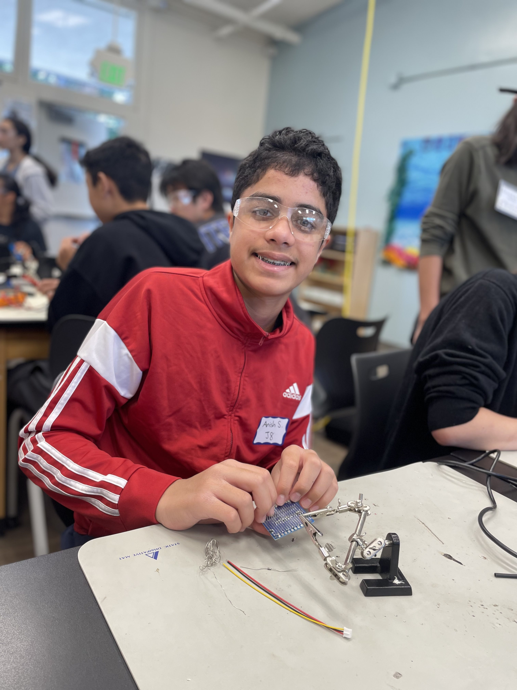

# Human-Following Robot

What if you could have a robot that follows you around effortlessly without your control? Well, this summer that will be my task to build such a robot. Thus, this would be the general goal for the robot.
Imagine the greater possiblities of being able to use your robot as a pet, only that it only requires some battery power! I hope to update this project as well in order to expand these possiblites.

| Anish S.| Stratford School | Computer Science | Incoming Freshman| Human Following Robot|

---

---

## Modifications

Here is my final video of my project working!

<iframe width="560" height="315" src="https://www.youtube.com/embed/kvfgtCt7e14?si=yHYKXcKN11CLE4w-" title="YouTube video player" frameborder="0" allow="accelerometer; autoplay; clipboard-write; encrypted-media; gyroscope; picture-in-picture; web-share" referrerpolicy="strict-origin-when-cross-origin" allowfullscreen></iframe>

For my modifications, I worked on the remote control and was able to wire it to my car, but in order to do this I actually first transitioned to the Arduino MEGA, which acts as a bigger 'brain' of the Arduino Uno, which I was originally given to work with. This transition proved to be a challenge because it required a lot of rewiring for my overall project, but I was able to get the remote control to connect to my robot! 

Next, I added 5 LEDs, one LED was for a speed of 200, and I had 4 LEDs that would light up if a certain key was pressed. The LEDs are placed in a certain way, such as forward, left, right, and backwards, as these are coordinated to the various omnidirectional movement of my robot. When the car moves forward, the red LED (which is located in the front), will light up. The same applies to the other LEDS. 

---

## Final Milestone

---

### Human Following Section

<iframe
  width="560"
  height="315"
  src="https://www.youtube.com/embed/gOkLrScD8wM"
  title="YouTube video player"
  frameborder="0"
  allow="accelerometer; autoplay; clipboard-write; encrypted-media; gyroscope; picture-in-picture"
  allowfullscreen>
</iframe>

For my human following robot, I did not do any extra assembly, and instead just combined the elements of the ultrasonic module and the obstacle avoidance module, as that is what this project is really all about. The code remained the same mostly, except I added a bigger if loop that would be able to detect the distance first, and then would move to the obstacle avoidance modules, meaning that it would see if the user'a hand was at the left or right. However, I also realized that any obkect in motion would work for the human following robot, and I realized that it could follow my foot and could effortlessly follow me around. I did not face too many challenges throughout this process.

Hopefully, for my next steps, I can connect the remote control, which is one of my modifications to the LEDs to see how they work. Below is an overall schematic that explains the overall wiring of the robot.

### Obstacle Avoidance Module

<iframe
  width="560"
  height="315"
  src="https://www.youtube.com/embed/5Uf2-arlHqA"
  title="YouTube video player"
  frameborder="0"
  allow="accelerometer; autoplay; clipboard-write; encrypted-media; gyroscope; picture-in-picture"
  allowfullscreen>
</iframe>

The first section of my final milestone involving making an obstacle avoidance module for my robot. For the assembly, there were threee attachment points for the obstacle avoidance module. One of the them was the OUT pin, which connects the obstacle avoidance module to the Arduino R3 Module. Then, another section is connected to GRD, and another to the 5V section. However, this process was different because I attached these to different points on the breadboard. In order to do this, I attached one wire from the exsisting GRD and 5V sections on the breadboard, and then the end of the wires was attached to the new connection point on the breadboard. I also learned about the pentimoeter, which is the components that needs to be screwed in enough in order to power up the LEDs. 

For the code, if the robot's obstacle avoidance modules do not face any obstacles, its natural behavior is to move forward. However, when I first tested this out the robot would have one motor move forwards and one move backwards, so I was able to change this so that the robot would move normally. Another challenge that I faced was that sometimes the back left and the back right functions were not working, despite activating the H-Bridge hubs that were supposed to be activating those sections. So, in order to solve this problem I was able to go back to some older code and found out that there the back left and back right functions were actually working. Another issue that I ran into was that the obstacle avoidance modules were not properly working, so I had to replace these modules in order to allow them to properly function. Finally, after much debugging and rengineering I was able to get my obstacle avoidance modules to function properly. 

### Ultrasonic Module

<iframe width="560" height="315" src="https://www.youtube.com/embed/q4kkl5KrUAc" frameborder="0" allow="accelerometer; autoplay; clipboard-write; encrypted-media; gyroscope; picture-in-picture" allowfullscreen></iframe>

The second section of the final milestone involved making an ultrasonic module for my robot. For the assembly, there are four attachment points for the ultrasonic module. One of these is the GRD and the 5V pin, which I attached near the connection point in the obstacle avoidance modules. I was able to do due to the rule that states that the current flows from the vertical positions in the breadboard. I also learned about the OUT and TRIG pins, which essentially act as the both input and outputs for the overall robot.

For the code, there are severl portions that act as the robots if loop. This will keep repeating contiously and is important to use when caculating distance. Naturally, the robot moves forward, but if it detects something within 5 to 25 cm, it will move backwards. However, if it detects something less than 5 cm away, then it will first stop, and then it will delay in roder to allow the transition time to move in the right direction. I ran into the issue of having too many delays, and that the robot would not move properly. I fixed the delays and was able to get the robot to move more contiously. To solve the moving issue, I just set both motors to the same speed by using two different variables, so that both motor would be working at the same speed.

Throughout this project, I also learned a lot about how thr ultrasonic module works overall. The formula will take the wave speed, and needs to be able to see the amount of time that it takes to travel to the object in order to determine the distance. This is also expained using the speed, time, and distance formula, but with the speed matching the speed of specifically sound waves. 

---

## Second Milestone

<iframe width="560" height="315" src="https://www.youtube.com/embed/nu14NIBjSes?si=qb4GKF6pG0DR5GHE" title="YouTube video player" frameborder="0" allow="accelerometer; autoplay; clipboard-write; encrypted-media; gyroscope; picture-in-picture; web-share" referrerpolicy="strict-origin-when-cross-origin" allowfullscreen></iframe>

<iframe width="560" height="315" src="https://www.youtube.com/embed/X0dyLCp5_js?si=Ynit8LUnFUbSQC8Y" title="YouTube video player" frameborder="0" allow="accelerometer; autoplay; clipboard-write; encrypted-media; gyroscope; picture-in-picture; web-share" referrerpolicy="strict-origin-when-cross-origin" allowfullscreen></iframe>

In this milestone, I tested the robot's movement. It first moves forward, then in all directions to form a full circle — which is critical for later code functions.

<iframe width="560" height="315" src="https://www.youtube.com/embed/_To6-qzbhQQ" frameborder="0" allowfullscreen></iframe>

In this video, the robot starts at a base speed and increases speed with a short delay between changes. It also demonstrates the opposite: starting fast and gradually slowing to a stop. The robot simulates acceleration and deceleration smoothly.

---

### Technical Explanation: Movement by Code

The robot's movement uses C++ functions to go forward, backward, left, and right. Motor A controls left-side movement and Motor B controls the right. The H-Bridge controls current flow. To stop the robot, all H-Bridge outputs are set to `LOW`.

---

### Technical Explanation: Speed Calibration

Using a `for` loop, the robot increases speed from 0 to 255 in increments of 5. This change is controlled using an integer variable `i`, and is important when rotating the robot to adjust turning responsiveness. 

Here is a wiring diagram for the speed calibration

<h6>Detailed Wiring Diagram for Speed Calibration - SunFounder Human Following Robot</h6>

     

Here is the wiring diagram for the line detector module attachment.

---

### Technical Explanation: Line Detector

This part was the most complex. The line detector connects to:
- **Pin 2** on the Arduino Uno
- **5V and GND** on the breadboard

The detector reads `1` when it detects a black line. I used the serial monitor to verify this behavior. Movement functions are triggered depending on whether the sensor reads a line or not.

Here you can see a more visual representation of the line detector code.

<h6>Detailed Wiring Diagram for SunFounder Line Following Robot</h6>

---

### Challenges Faced

At first, I assumed the motors weren’t working, but after testing, I discovered the issue was a logic error in the `turnRight` function. I corrected the motor wiring logic by switching values for Motor B’s control pins, which fixed directional movement.

---

## First Milestone

  <iframe width="560" height="315"
    src="https://www.youtube.com/embed/zruteu_Ingk"
    frameborder="0"
    allowfullscreen>
  </iframe>

### Technical Explanation: Assembly
First, I began by attaching every component on. Some challenges with this was that one of the pieces of the motor broke off, and I thought that I had to get a new motor. This then also made me think I had to get some new wheels because one of the wheels had a piece of the motor inside.  To solve this problem, I just flipped the motor around so that it could still be used, and I was able to use two identical wheels instead. Then, I had to begin attaching some of the wires. First, I started by attaching the motor’s wires to the L9110 module. 

This would ensure that the wheels would rotate in the correct direction. Next, I attached the Ground and 5 Volt sections from the Arduino Uno board into the breadboard. This was an important step because it would ensure that the other components were connected to the Ground and the battery. Then, I took the same module the motors were attached to and attached all of the parts to the breadboard. Some of the parts were attached on one side (which was all connected to the Ground), and then some of the parts were connected to the other side, which was connected to the 5 volt connector. 

### Technical Explanation: Debugging the Code
The next step of the process was testing and debugging the overall code. When testing it, the robot would first just start to spin around in some circles. The reason this was occurring was because the obstacle avoidance module was not secure, and it was instead spinning that module around, which caused this issue. However, even after securing this module, the robot behaved similarly. So, I then changed some of the wiring on the motors, after which I saw the right wheel moved forward, and the left wheel moved backward. So, I switched the position of the left motor’s wires. Then, after that, both wheels started moving backward. Finally, the robot started behaving as expected and I had finished moving it by code. 

### Next Steps
Next, I hope to be able to move the robot by using Arduino code, which would use the programming language C. I also hope to be able to increase the several applications that my robot might be able to do in the future. 

---

### Wiring Schematic

Below is a visual of how different components like the batteries, Arduino, and breadboard connect.

---

## Starter Project

<iframe width="560" height="315" src="https://www.youtube.com/embed/xZFvOUwT63U" frameborder="0" allowfullscreen></iframe>

For my starter project, I chose the **Weevil Eye**. It helped me learn about sensors and improve soldering skills. I initially struggled with LED leg orientation and had to restart. When I restarted, the process was a lot more simple because I understood what components were inccoled and what their specific roles were. While I have done projects that are battery powered, this project also introduced me to the idea of how to use a battery coin. For me, this was a lot more challenging because it was hard to take out the battery coin after it had been inserted. One issue that I did when I resarted is the placement of the sensor, which was not soldered in fully. The next time that I solder, I will ensure that all the components are soldered in fully without actually breaking thd compoennts.

Below is a schematic, which explains the wiring of the overall assmebly and wirings of the Weevil Eyes. 

---

---
# Bill of Materials
Below I list the project materials for the project. Most of the supplies that I used are attached in the kit

<table>
  <thead>
    <tr>
      <th>Product</th>
      <th>Description</th>
      <th>Price</th>
      <th>Link</th>
    </tr>
  </thead>
  <tbody>
    <tr>
      <td>3 in 1 Starter Kit for Human Following Robot</td>
      <td>This contains all the part necessary for the project</td>
      <td>$69.99</td>
      <td><a href="https://www.sunfounder.com/products/sunfounder-3-in-1-iot-smart-car-learning-ultimate-starter-kit">Link</a></td>
    </tr>
  </tbody>
</table>

---

# Code Explanantions

<html lang="en">
<head>
    <meta charset="UTF-8">
    <meta name="viewport" content="width=device-width, initial-scale=1.0">
    <title>Arduino Project Documentation</title>
    
</head>
<body>

    

    <h2>1. Move by Code Explanantions</h2>
    <table>
        <thead>
            <tr>
                <th>Code/Functions</th>
                <th>Explanation</th>
            </tr>
        </thead>
        <tbody>
            <tr>
                <td><pre>const int A_1B = 5;
const int A_1A = 6;
const int B_1A = 9;
const int B_1B = 10;</pre></td>
                <td>Initializes every pin that I used throughout the project on the Arduino board through pins 5, 6, 9 and 10 and they all appear on the Arduino Uno board.</td>
            </tr>
            <tr>
                <td><pre>void setup() {
  pinMode(A_1B, OUTPUT);
  pinMode(A_1A, OUTPUT);
  pinMode(B_1A, OUTPUT);
  pinMode(B_1B, OUTPUT);
}</pre></td>
                <td>The second set explains how on the L9110 module there are pins (like A_1A, B) that act as the output for the pins. The input of all the pins are then in their respective location in the Arduino Uno board.</td>
            </tr>
            <tr>
                <td><pre>void moveForward() {
  digitalWrite(A_1A, HIGH);
  digitalWrite(A_1B, LOW);
  digitalWrite(B_1A, HIGH);
  digitalWrite(B_1B, LOW);
}</pre></td>
                <td>The "LOW" that is shown means that that section will not be activated. The "HIGH" that is shown represents an activation in the move forward code.</td>
            </tr>
            <tr>
                <td><pre>void moveBackward() {
  digitalWrite(A_1A, LOW);
  digitalWrite(A_1B, HIGH);
  digitalWrite(B_1A, LOW);
  digitalWrite(B_1B, HIGH);
}</pre></td>
                <td>For the move forward section, it means that the motor will only move a certain direction, in this case it is forward and the A_1A and the B_1B sections on the L9110 module. For the move backward section, it means that the motor will only move a certain direction, in this case it is backward and the A_1B and the B_1A sections on the L9110 module.</td>
            </tr>
            <tr>
                <td><pre>void turnRight() {
  digitalWrite(A_1A, HIGH);
  digitalWrite(A_1B, LOW);
  digitalWrite(B_1A, LOW);
  digitalWrite(B_1B, HIGH);
}</pre></td>
                <td>In this case it is backward and the A_1B and the B_1A sections on the L9110 module.</td>
            </tr>
            <tr>
                <td><pre>void turnLeft() {
  digitalWrite(A_1A, LOW);
  digitalWrite(A_1B, HIGH);
  digitalWrite(B_1A, HIGH);
  digitalWrite(B_1B, LOW);
}</pre></td>
                <td>The "LOW" that is shown means that that section will not be activated. The "HIGH" that is shown represents an activation in the move forward code. For the move right section, it means that the motor will only move a certain direction, in this case it is right and the A_1B and the B_1B sections on the L9110 module. For the move left section, it means that the motor will only move a certain direction, in this case it is left and the A_1A and the B_1A sections on the L9110 module.</td>
            </tr>
            <tr>
                <td><pre>void stopMove() {
  digitalWrite(A_1A, LOW);
  digitalWrite(A_1B, LOW);
  digitalWrite(B_1A, LOW);
  digitalWrite(B_1B, LOW);
}</pre></td>
                <td>This is the most simple piece of code and the most important. This is because its function is to set each pin to LOW, meaning that none of the pins will be activated and this will allow for the robot to stop moving. This is added at the end of the code upon completion of the movements for forward, backward, left, and right.</td>
            </tr>
            <tr>
                <td><pre>void loop() {
  moveForward();
  delay(2000);
  stopMove();
  delay(500);

  moveBackward();
  delay(2000);
  stopMove();
  delay(500);

  turnLeft();
  delay(2000);
  stopMove();
  delay(500);

  turnRight();
}</pre></td>
                <td>The robot goes forward for 2 seconds, stops for 0.5 seconds, then goes backward for 2 seconds, stops for 0.5 seconds, and repeats this cycle forever. Then, it repeats this same process, but for moving left and right. The delays are the same here. Delays are represented in milliseconds delay (2000) = 2 second delay delay (500) = 0.5 second delay The void loop must be declared in order for this process to be repeated. The move forward and the move backward must be defined in order for this to occur, and these codes are added in earlier sections.</td>
            </tr>
            <tr>
                <td><pre>delay(2000);
stopMove();
delay(500);</pre></td>
                <td>The same is required for moving left and right.</td>
            </tr>
        </tbody>
    </table>

</body>
</html>

<html>
<head>

</head>
<body>

## <h1>2. Speed Up Code Explanantions</h1>

<table>
  <thead>
    <tr>
      <th>Code</th>
      <th>What it Means</th>
    </tr>
  </thead>
  <tbody>
    <tr>
      <td><pre>void loop() {</pre></td>
      <td>This is a loop, meaning that it will increase</td>
    </tr>
    <tr>
      <td><pre>for(int i=0;i&lt;=255;i+=5){
  moveForward(i);
  delay(500);
}</pre></td>
      <td>
        
The code by 5 starting from 0 repeatedly until it reaches its ending point. The "i" is a variable that changes, and this is what is being increased. "i" is also an integer.

        
Pattern of i - 5, 10, 15, 20, 25, 30, 35, 40, 45, 50, 55, .... 245, 250, 255

        
The greater the number, the faster the speed will be.

        
The delay (500) means that it will go for ½ a second after <strong>each</strong> increase in speed. Each increase in speed indicates a change in the variable i.

      </td>
    </tr>
    <tr>
      <td><pre>for(int i=255;i>=0;i-=5){
  moveForward(i);
  delay(500);
}</pre></td>
      <td>
        
This is a continuation of the other loop, and this changes by decreases of 5 and it starts from 255 and keeps decreasing. Again, it acts as an integer.

        
Pattern of i - 255, 250, 245, 240, 235, 230, ... 10, 5, 0

        
The greater the number, the faster the speed

        
The delay applies to the same, but occurs on each <strong>decrease</strong> in speed, which also affects the variable i.

      </td>
    </tr>
    <tr>
      <td><pre>void moveForward(int speed) {
  analogWrite(A_1B, 0);
  analogWrite(A_1A, speed);
  analogWrite(B_1B, speed);
  analogWrite(B_1A, 0);
}</pre></td>
      <td>
        
This is a <strong>function</strong> that will allow the motors to rotate and it works with the loop. Specifically, this works with the green hubs in the H-Bridge, which is located in the L9110 module.

        
The "0" indicates that the section will stay put and will not be activated.

        
The "speed" is a little more complicated, but not hard to understand. This will adjust based on the speed which has been provided in the loop (which is explained earlier). Thus, this function will constantly be adjusted based on the signals provided from the loop to the robot. Additionally, "int" is referring to the variable "i", which was used earlier.

      </td>
    </tr>
    <tr>
      <td></td>
      <td>
This code will actually allow the changes above to be implemented on the robot.

      
The hubs that are marked with "speed" indicate specifically marked with that because as described it explains that it is the hubs that are specifically connected to to the motor that are designed to move the robot forwards.
</td>
    </tr>
    <tr>
      <td><pre>for (initialization; condition; increment) {
  // statement(s);
}</pre></td>
      <td>Use these lines in order to make the conditions work and check each iteration during, before, and after.</td>
    </tr>
  </tbody>
</table>

</body>
</html>

<html>
<head>

</head>
<body>

## <h1>3. Follow the Line Code Explanantions</h1>

<table>
  <thead>
    <tr>
      <th>Code</th>
      <th>What it Means</th>
    </tr>
  </thead>
  <tbody>
    <tr>
      <td><pre>const int A_1A = 5;
const int A_1B = 6;
const int B_1B = 9;
const int B_1A = 10;</pre></td>
      <td>This is the very beginning of the code, which means that all of the pins have to be set up.</td>
    </tr>
    <tr>
      <td><pre>const int lineTrack = 2;</pre></td>
      <td>The first four lines connect the pins on the Arduino Uno Board to the H-Bridge hubs, as explained earlier.</td>
    </tr>
    <tr>
      <td></td>
      <td>The last line works differently, but it does involve setting up all the pins. But, the basic assembly for the line following robot connects the Line Tracking Module with Pin 2.</td>
    </tr>
    <tr>
      <td><pre>void setup() {
  Serial.begin(9600);
}</pre></td>
      <td>
        
This line involves the setup, where everything needs to be defined.

        
The Serial.begin code allows for a smoother connection between the USB and the computer. This can be used for sending messages or for fixing code (debugging).

        
Communication Speed = 9600 bits per second

      </td>
    </tr>
    <tr>
      <td><pre>//Motor
pinMode(A_1B, OUTPUT);
pinMode(A_1A, OUTPUT);
pinMode(B_1A, OUTPUT);
pinMode(B_1B, OUTPUT);
//Line track
pinMode(lineTrack, INPUT);</pre></td>
      <td>
        
These lines of code follow the standard format/setup of <strong>pinMode (input, output)</strong>

        
For the first four lines, which we have already used, the H-Bridge ports act as the output.

        
For the final line, the line tracking robot's job is to send an input signal to the microcontroller.

      </td>
    </tr>
    <tr>
      <td><pre>void loop() {</pre></td>
      <td>This code means that the void loop is starting</td>
    </tr>
    <tr>
      <td><pre>int speed = 150;</pre></td>
      <td>and this is the part that is going to be repeated multiple times.</td>
    </tr>
    <tr>
      <td></td>
      <td>The int speed means that the code is setting up the motor speed will be 150 (the speed vary from 0 (not moving) to 255 (which is the maximum possible speed))</td>
    </tr>
    <tr>
      <td><pre>int lineColor = digitalRead(lineTrack);
// 0:white 1:black
Serial.println(lineColor); //print on the serial monitor</pre></td>
      <td>
        
This line means that the computer is going to read the line track and is going to do it based on the color

        <ul>
          <li>0 - indicates that the digital read will not activate at all, and since the color is white then it is "0"</li>
          <li>1 - indicates that the digital read will activate, since the line has been detected</li>
        </ul>
        
Then this signal is shown to the serial monitor so we can always set up earlier. So you see what is detected.

      </td>
    </tr>
    <tr>
      <td><pre>if (lineColor) {
  moveLeft(speed);
} else {
  moveRight(speed);
}</pre></td>
      <td>
        
The first line indicates if the line color equals 1, meaning that it essentially states "if line is detected". Then it moves right.

        
If the line color is 0 (since it is an else function and it can't mean anything else besides 0 at this point), then the robot will move right.

      </td>
    </tr>
    <tr>
      <td><pre>void moveLeft(int speed) {
  analogWrite(A_1B, 0);
  analogWrite(A_1A, speed);
  analogWrite(B_1B, 0);
  analogWrite(B_1A, 0);
}</pre></td>
      <td>
        
The move left function will only activate if a line is detected. Then, the certain motors (in this case Motor A marked by the L9110 module) will activate. For the right function, this activates if the robot does not detect a line, and works with Motor B.

        
The second line will stop Motor A to go in a reverse direction. The third line will allow the motor to go to a certain speed. This hub is what allows the robot to move at a certain speed.

        
The right section and the third line will stop

      </td>
    </tr>
    <tr>
      <td><pre>void moveRight(int speed) {
  analogWrite(A_1B, 0);
  analogWrite(A_1A, 0);
  analogWrite(B_1B, speed);
  analogWrite(B_1A, 0);
}</pre></td>
      <td>Motor B to go in a reverse direction. The third line will allow the motor to go to a certain speed. This hub is what allows the robot to move at a certain speed.</td>
    </tr>
  </tbody>
</table>

</body>
</html>

<html>
<head>
<title>Robot Project Glossary and Components</title>

</head>
<body>

<h1>Ultrasonic Sensor Code Explanation</h1>
    <table>
        <thead>
            <tr>
                <th>Code</th>
                <th>What It Means</th>
            </tr>
        </thead>
        <tbody>
            <tr>
                <td><pre>const int trigPin = 3;
const int echoPin = 4;</pre></td>
                <td>Set the trig and echo pins, which are located on the Ultrasonic Module, to their respective pin locations on the Arduino Uno Board.</td>
            </tr>
            <tr>
                <td><pre>//ultrasonic
pinMode(echoPin, INPUT);
pinMode(trigPin, OUTPUT);</pre></td>
                <td>The ultrasonic module has these two pins, echo and trig. The echo pin will be the input and provide the signal, and the trig pins will be the output and give the output that results from the output signal.</td>
            </tr>
            <tr>
                <td><pre>void loop() {
  float distance = readSensorData();
  if (distance > 25) {
    moveForward(200);
  } else if (distance < 10 && distance > 2) {
    moveBackward(200);
  } else {
    stopMove();
  }
}</pre></td>
                <td>The loop will keep repeating, and now we have started this. The float distance will store the distance variable, and will read the distance, and will store it as a float if needed (as a decimal point). <strong>Distance units are in centimeters.</strong> If the robot detects the distance to be greater than 25 units, then it will move forward at a speed of 200, as this unit will still allow the robot to smoothly move forward. However, the else if runs on two conditions, one of which being if the distance is greater than 2 units, and is less than 10, but greater than 2. If these conditions are true, then the robot moves backward at a speed of 200. Essentially, if 2 &lt; distance &lt; 10, the robot moves backwards. If none of the above conditions are true, the robot will completely stop moving.</td>
            </tr>
            <tr>
                <td><pre>float readSensorData() {
  digitalWrite(trigPin, LOW);
  delayMicroseconds(2);
  digitalWrite(trigPin, HIGH);
  delayMicroseconds(10);
  digitalWrite(trigPin, LOW);
  float distance = pulseIn(echoPin, HIGH);
}</pre></td>
                <td>This code acts as a function and will read the data on the sensor, specifically the ultrasonic module. First, it will set the trig pin to low, and then wait for just 2 microseconds. Then, the trig pin is set to HIGH for 10 microseconds. In turn, this will give a sound wave from the ultrasonic sensor. Next, there is a formula that is used in order to calculate the distance. This will calculate the distance, which is sent back to the void loop. This formula is <strong>distance = speed of sound/time</strong>. The 58.00 is the speed of sound, and is converted from the speed of sound. Additionally, the time gets changed to use a unit of centimeters, and the speed of sound is used to help with this calculation. Finally, after everything is calculated, the distance is returned.</td>
            </tr>
            <tr>
                <td><pre>/ 58.00; //Equivalent to (340m/s*us)/2
return distance;</pre></td>
                <td>This is the continuation of the previous code block, specifically the calculation and return of the distance.</td>
            </tr>
        </tbody>
    </table>
</body>
</html>

<h2>Follow your Hand Code</h2>

<table>
  <thead>
    <tr>
      <th>Chart</th>
      <th>What it Means</th>
    </tr>
  </thead>
  <tbody>
    <tr>
      <td>
        <pre><code>if (distance > 5 && distance < 10) {
  moveForward(speed);
} else if (!right) {
  turnLeft(speed);
} else if (!left) {
  turnRight(speed);
} else {
  stopMove();
}
</code></pre>
      </td>
      <td>
        This code combines all of the past elements that we have been using. It says that if the distance is between 5 and 10, then the robot moves forward. Then, if that is not the case, it detects if there is an obstacle on the right, and if there is then it will turn left as a result. If there is no obstacle on the right, then it will see if there is an obstacle on the left. If there is an obstacle there (on the left), then the robot will move right. If none of these conditions are true, then the robot stops moving completely.
      </td>
    </tr>
  </tbody>
</table>

<h2>Glossary of Terms</h2>

<table>
  <thead>
    <tr>
      <th>Term</th>
      <th>What it Means</th>
    </tr>
  </thead>
  <tbody>
    <tr>
      <td>!</td>
      <td>In C++, when you use the exclamation point it means <strong>not</strong> or the <strong>opposite of</strong>. Its technical meaning is called the "logical NOT" operator.</td>
    </tr>
    <tr>
      <td>&&</td>
      <td>This means that both of the conditions separated by this symbol must be true. This is formally known as the "<strong>logical AND</strong>" operator.</td>
    </tr>
    <tr>
      <td>!left</td>
      <td>This means that it will refer to an obstacle on the left obstacle avoidance module. This condition will hold true if the obstacle avoidance module detects an obstacle on the left.</td>
    </tr>
    <tr>
      <td>!right</td>
      <td>This refers to the right obstacle avoidance module. This condition will hold true if the obstacle avoidance module detects an obstacle on the left side.</td>
    </tr>
    <tr>
      <td>left</td>
      <td>This will control the left obstacle avoidance module and holds true if there is not an obstacle on the left.</td>
    </tr>
    <tr>
      <td>right</td>
      <td>This will control the right obstacle avoidance module and holds true if there is not an obstacle on the right.</td>
    </tr>
    <tr>
      <td>pin</td>
      <td>For the human-following robot, the "pin" term refers to the Arduino R3 board that the wires are connected to. On the right side, there are some numbers from 0-13. In this case, "pin" refers to any of these numbers.</td>
    </tr>
    <tr>
      <td>value</td>
      <td>
        <ol>
          <li><strong>"HIGH"</strong> - This to the computer means "1", meaning that the component to which the high value is assigned will activate.</li>
          <li><strong>"LOW"</strong> - This to the computer means "0", meaning that the component to which the high value is assigned will not activate.</li>
        </ol>
      </td>
    </tr>
    <tr>
      <td>(pin, value)</td>
      <td>These two terms above are referring to the (pin, value) format used in the code.</td>
    </tr>
    <tr>
      <td>pin</td>
      <td>For the human-following robot, the "pin" term refers to the Arduino R3 board that the wires are connected to. On the right side, there are some numbers from 0-13. In this case, "pin" refers to any of these numbers. This however refers to what mode the pin is being set to.</td>
    </tr>
    <tr>
      <td>mode</td>
      <td>Refers to INPUT -> What is being plugged into   Refers to OUTPUT</td>
    </tr>
    <tr>
      <td>for</td>
      <td>Used to repeat a certain amount of statements. Important: These statements <strong>must</strong> be in the curly braces. (see last code term for more information)</td>
    </tr>
    <tr>
      <td>initialization</td>
      <td>Will always be one of the first things to happen in the loop. This occurs <strong>once</strong> throughout the entire loop.</td>
    </tr>
    <tr>
      <td>condition</td>
      <td>This is what is tested throughout the loop. If true -> executed. If it is false, then the loop ends.</td>
    </tr>
    <tr>
      <td>increment</td>
      <td>Always goes through each time if the condition (as described earlier) is true.</td>
    </tr>
  </tbody>
</table>

